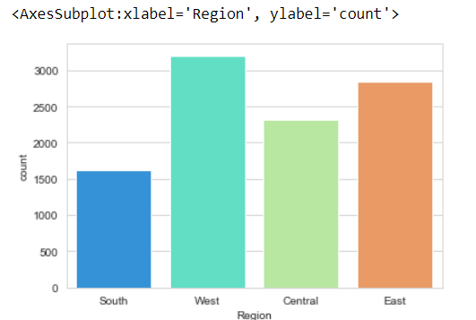

# Ex-08-Data-Visualization-

## AIM
To Perform Data Visualization on a complex dataset and save the data to a file. 

# Explanation
Data visualization is the graphical representation of information and data. By using visual elements like charts, graphs, and maps, data visualization tools provide an accessible way to see and understand trends, outliers, and patterns in data.

# ALGORITHM
### STEP 1
Read the given Data
### STEP 2
Clean the Data Set using Data Cleaning Process
### STEP 3
Apply Feature generation and selection techniques to all the features of the data set
### STEP 4
Apply data visualization techniques to identify the patterns of the data.

### CODE
```
# Importing packages
import pandas as pd
import numpy as np

# Importing visualization libraries
import seaborn as sns
import matplotlib.pyplot as plt

df_super = pd.read_csv('Superstore.csv')

df_super.head(5)

df_super=df_super.groupby(by=["Category"]).sum()
labels=[]
for i in df_super.index:
    labels.append(i)  
plt.figure(figsize=(8,8))
colors = sns.color_palette('pastel')
plt.pie(df_super["Profit"],colors = colors,labels=labels, autopct = '%0.0f%%')
plt.show()


sns.set_style('whitegrid')
sns.countplot(x='Segment',data=df_super, palette='rainbow')

sns.set_style('whitegrid')
sns.countplot(x='Category',data=df_super, palette='rainbow')

sns.set_style('whitegrid')
sns.countplot(x='Sub-Category',data=df_super, palette='rainbow')

sns.set_style('whitegrid')
sns.countplot(x='Region',data=df_super, palette='rainbow')

sns.set_style('whitegrid')
sns.countplot(x='Ship Mode',data=df_super, palette='rainbow')

category_hist = sns.FacetGrid(df_super, col='Ship Mode', palette='rainbow')
category_hist.map(plt.hist, 'Category')
category_hist.set_ylabels('Number')

subcategory_hist = sns.FacetGrid(df_super, col='Segment', height=10.5, aspect=4.6)
subcategory_hist.map(plt.hist, 'Sub-Category')
subcategory_hist.set_ylabels('Number')

grid = sns.FacetGrid(df_super, row='Category', col='Sub-Category', height=2.2, aspect=1.6)
grid.map(sns.barplot, 'Profit', 'Segment', alpha=.5, ci=None)
grid.add_legend()
```
# OUPUT





### RESULT
Data Visualization has been performed on a complex dataset and saved the data to a file.